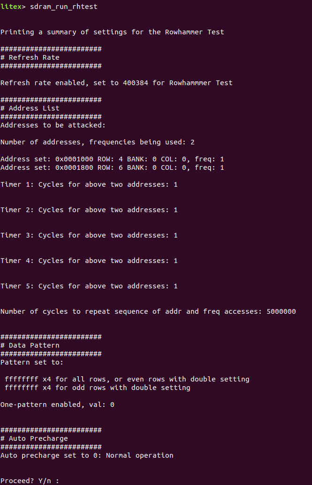

Source the virtual environment and Vivado, or source the shell script:

```
source env.sh
```

Run the command to build and load the bitstream:

```
python dependencies/litex-boards/litex_boards/targets/digilent_nexys_video.py --build --load
```

Run the bios with the command:
```
litex_term /dev/ttyUSBX
```

The program will run with the Row Hammer commands in the bios.

## Commands

At first, the command ```sdram_summary_rhtest``` will output the following:


### Refresh Rate

The default clock rate for this board is 100e6, thus a refresh rate (tREFI) of 782 is equivalent to 782 / 100e6 Hz = 7.82us. 

This only specifies the value of the refresh rate during the row hammering, not the initial writing, reading, and final reading. 
The refresh rate can be changed with ```sdram_set_ref_rate_rhtest <refresh_rate>``` where a value of 0 by default disables the refresher.

### Hammered Addresses

The address in LiteDRAM is organized by Row, then Bank, then column, and can be found in LiteDRAM. 
I did add a function to help:


Hammering is done with reads.
This program hammers up to 20 addresses for each test. 
The first five pairs of addresses can repeat before moving on to the last ten.
To specify an address to hammer, the command to use is ```sdram_set_addr_freq_rhtest <order_val> <addr_val>```. 
The ```order_val``` is a number in range 0-19, starting with 0 and incrementing by 1. 
For example, if I want to add rows 1, 3, and 5 to hammer in that order on the nexys video, I would do the following:


The addresses in the ```sdram_summary_rhtest``` command would appear as:


The ```sdram_set_cycles_rhtest <cycles> <timer_num>``` command changes either the cycles for the first five different pairs or all addresses combined.
The values of ```<timer_num>``` are 0 for the cycles of all addresses and 1-5 for the cycles of the pairs 1-5. 
For the sake of the example, if I wanted to hammer the first pair of addresses twice before hammering the third once, I would do the following:


Then if I wanted to run this sequence three times, I would do:


The summary would look like the following:


Setting all the cycles back to 1, if I wanted to take off the last address, I would use the ```sdram_pop_addr_freq_rhtest``` command:


Then if I wanted to set the first address to row 5 instead of row 1, I would do:


The resulting summary would be:


### Data pattern

A 32-bit data value is replicated across the data width of the port to be written and tested.
There are two settings for now: one-pattern and two-pattern.
In the one-pattern setting, the first 32-bit value shown will only be used, while the two-pattern setting uses both 32-bit values for even and odd rows as shown. 
To change the setting, use the ```sdram_enable_double_pattern_rhtest <enable_val>``` command with ```<enable_val>``` with one or zero:


To change the patterns used, use the ```sdram_set_pattern_rhtest <pattern_val> <data_sel>``` command setting ```<pattern_val>``` to the 32-bit pattern and ```<data_sel>``` to 0 for even rows (or all rows in the one-pattern setting) or 1 for odd rows:


### Auto Precharge

The ```sdram_set_addr_freq_rhtest <order_val> <addr_val> <freq_val>``` has a 32-bit third argument ```<freq_val>``` to adjust the number of times an address is read, and by default this is 1. 
This is pretty useless as the DRAM row is read from an already activated row.
You can enable the auto-precharge setting with the ```sdram_set_auto_precharge_rhtest <value>``` command to constantly read and precharge a row, ```<value>``` being 1 for enable or 0 for disable:


### Running the test

It is simply done with the ```sdram_run_rhtest``` command, followed by an ```Enter```, ```y | Y```, ```n | N``` at the ```Proceed? Y/n :``` prompt.

Below is an example (lowered refresh rate) of a double-sided attack to get some errors with the nexys video:




