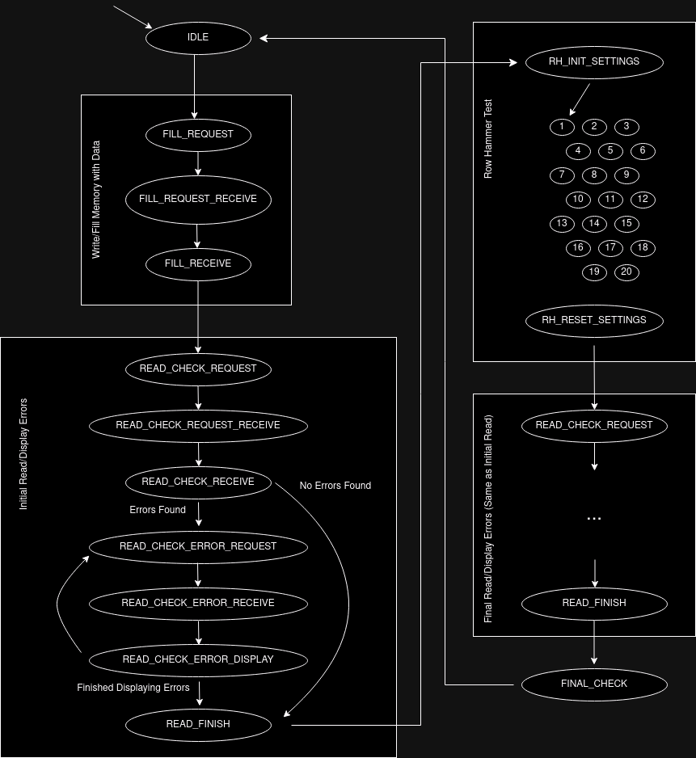

# Row Hammer Demonstration

A simple rowhammer testing program using the LiteDRAM controller.

This was created for both a class project and research.

## State Machine

## Installation

See [this guide](https://github.com/tylerricks377/dram_row_hammer_test/blob/main/DRAM_Row_Hammer_Test/docs/install.md) for the setup of this project.

## Use

This [section](https://github.com/tylerricks377/dram_row_hammer_test/blob/main/DRAM_Row_Hammer_Test/docs/instruction.md) will show how this project runs with the **Digilent Nexys Video** board. 
This project was also tested with the Nexys4DDR and Antmicro Datacenter DDR4 boards.
It should generally be useful for DRAM chips supported by LiteDRAM as long as the port data width is a multiple of 32 bits up to a 576 bit data width.

