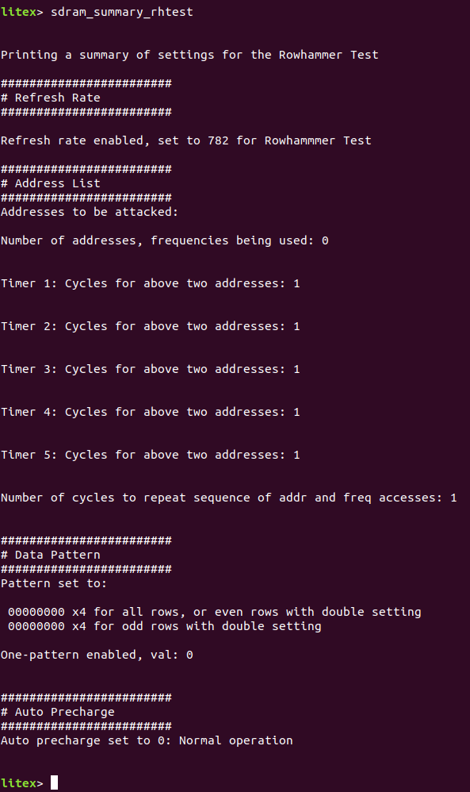
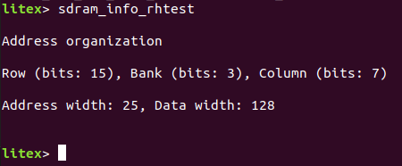

# Row Hammer Demonstration

A simple rowhammer testing program using the LiteDRAM controller.

This was created for both a class project and research.

## State Machine


## Installation

See this guide for the setup of this project.

## Use

This section will show how this project with the **Digilent Nexys Video** board. 
This project was also tested with the Nexys4DDR and Antmicro Datacenter DDR4 boards.
It should generally be useful for DRAM chips supported by LiteDRAM as long as the port data width is a multiple of 32 bits up to a 576 bit data width.

Source the virtual environment and Vivado, or source the shell script:

```
source env.sh
```

Run the command to build and load the bitstream:

```
python dependencies/litex-boards/litex_boards/targets/digilent_nexys_video.py --build --load
```

Run the bios with the command:
```
litex_term /dev/ttyUSBX
```

The program will run with the Row Hammer commands in the bios.

## Commands

At first, the command ```sdram_summary_rhtest``` will output the following:



### Refresh Rate

The default clock rate for this board is 100e6, thus a refresh rate (tREFI) of 782 is equivalent to 782 / 100e6 Hz = 7.82us.  

This only specifies the value of the refresh rate during the row hammering, not the initial writing, reading, and final reading. 
The refresh rate can be changed with ```sdram_set_ref_rate_rhtest <refresh_rate>``` where a value of 0 by default disables the refresher.

### Hammered Addresses

The address organization can be found in LiteDRAM. I did add a function to help:




